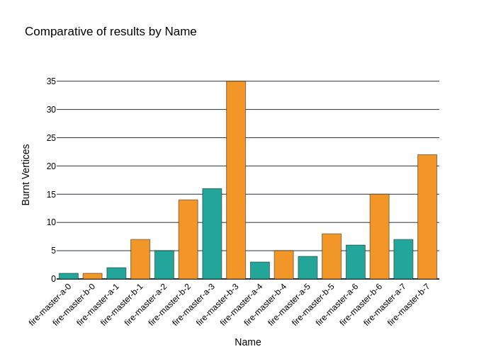

# RL_MFP

This repository contains a translator from instances of the Moving Firefighter Problem (MFP) into the Bulldozer environment. The MFP is a problem derived from graph theory. Here, we provide an implementation to translate instances of the MFP into an environment suitable for solving with Deep Reinforcement Learning using the Bulldozer framework.

## Results

We share the results of running both algorithms (MFP and Bulldozer) on translated instances:

1. 
2. 
3. 

## Links

- [Moving Firefighter Problem (MFP)](https://www.mdpi.com/2038212)
- [MFP Repository](https://github.com/BrunoGupa/MovingFirefighterProblem)
- [Bulldozer Benchmark Repository](https://github.com/elbecerrasoto/gym-cellular-automata)

